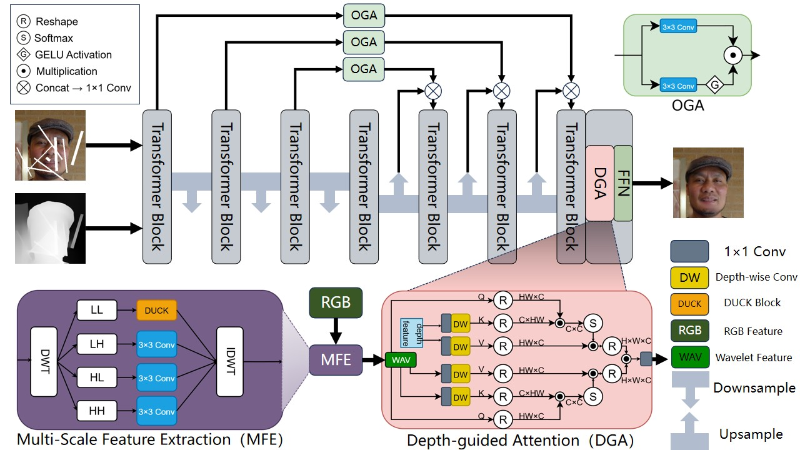

# Blind Image Inpainting with Depth Guidance and DUCKBlock

This repository presents a **Transformer-based blind image inpainting model** that integrates:
- ✅ Depth-guided dual attention
- ✅ Wavelet-based frequency-aware feature decomposition
- ✅ Multi-branch DUCKBlock for robust structure modeling

The method is designed for **mask-free inpainting** of corrupted images, leveraging both RGB and estimated depth modalities to achieve semantically and structurally consistent restorations.

---

## 🧱 Architecture

<p align="center">
  
</p>

---

## 📁 Dataset Structure

Organize your dataset as follows:

```
datasets/
├── celeb/
│   ├── input/      # corrupted images
│   └── target/     # corresponding ground truth images
├── ffhq/
│   ├── input/
│   └── target/
└── ...             # other datasets (optional)
```

> 📌 *Depth maps* should be stored separately and automatically loaded via filename matching in the training script.

---

## 🚀 Training

Use the following command to start training:

```bash
python main.py
```

All training hyperparameters (e.g. transformer depth, batch size, patch size) are configurable via `utils_train.py`.

---
